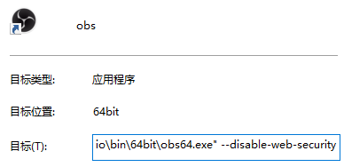
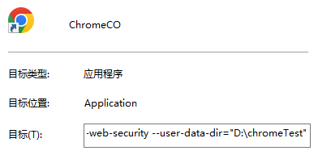

# Bilibili Live Clipqueue v1.0.9

Bilibili 直播切片队列

用于观众在直播间发送 "/BVxxxxxxx" 视频号,主播可以直接查看

并且增加了对[streamer.bot](https://streamer.bot/)的支持!!!!!

这是一个用 react 编写的项目,参考了[bilibili-live-chat](https://github.com/Tsuk1ko/bilibili-live-chat)和[bilibili-live-ws](https://github.com/simon300000/bilibili-live-ws)

成品部署在 github pages 上,使用者无需任何配置,打开网站即可使用

## 食用步骤

1. 确保你在 Bilibili 注册了个人开发者,详细方法见[开放平台](#开放平台)
2. 确保你开启了跨域模式,详细方法[跨域模式](#跨域模式)
3. 打开 [bilibili-live-clipqueue app](https://fedoraiver.github.io/bilibili-live-clipqueue)
4. 按照使用说明进行设置
5. 点击进入 Queue 页面(必须在 Queue 页面,否则后台程序不会运行)
6. Enjoy~

## 开放平台

开放平台为 Bilibili 官方开放的连接方式,注册方法如下

1. 前往开放平台注册个人开发者([注册地址](https://open-live.bilibili.com/open-register-form/personal)),提交注册后需要等待审核通过
2. 前往[创作者服务中心](https://open-live.bilibili.com/open-manage)-我的项目,随意创建一个项目,点进项目拿到**项目 ID**
3. 前往[创作者服务中心](https://open-live.bilibili.com/open-manage)-个人资料,拿到 **access_key_id** 和 **access_key_secret**
4. 获取**身份码**，两种方法任选其一
   - [我的直播间](https://link.bilibili.com/p/center/index/#/my-room/start-live)-开始直播-身份码
   - [互动应用中心](https://play-live.bilibili.com/)-右下角菜单-身份码

## 跨域模式

B 站 API 无法被跨域调用,需要开启跨域模式,方法如下：

任何基于 Chromium 的浏览器(例如 OBS Browser 和 Chrome)都需要通过添加 `--disable-web-security` 启动参数来禁用网页安全机制

示例：

- OBS:直接在启动的快捷方式后追加该参数,然后通过快捷方式启动即可  
  
- Chrome,和 OBS 同理,不过必须额外添加一个 `--user-data-dir` 参数来指定用户目录,随意新建一个空文件夹来指定即可  
  该操作看上去十分麻烦,实则是 Chrome 的一个安全措施,因为**禁用网页安全机制是危险行为,日常使用时千万别这么做,建议新建一个快捷方式专门用于 bilibili-live-clipqueue,日常上网使用原来的快捷方式**  
  

其他内核的浏览器可以自行搜索相应参数来禁用网页安全机制

## streamer.bot

### 什么是 streamer.bot

streamer.bot 是一个用于直播的机器人服务,支持 obs 和 streamlabs 等直播软件,可以增强直播体验。这些机器人可以执行各种任务,如管理聊天室、播放特定内容、收集数据等。可惜的是,streamer.bot 暂时只支持 twitch,youtube 等国外的直播平台,暂时不支持国内的直播平台。

B 站既然有直播开放平台可以获取直播的数据,比如观众发送的弹幕,赠送的礼物等,为什么不能把这些数据发送给 streamer.bot 呢？于是便有了本项目。

### 使用方法

在[B 站直播开放平台手册](https://open-live.bilibili.com/document/f9ce25be-312e-1f4a-85fd-fef21f1637f8)里规定了各种直播间数据的格式。我们要在 [bilibili-live-clipqueue app](https://fedoraiver.github.io/bilibili-live-clipqueue)里填写的是[B 站直播开放平台手册](https://open-live.bilibili.com/document/f9ce25be-312e-1f4a-85fd-fef21f1637f8)里的 CMD 和 streamer.bot 里 action 的名称,意思是收到这个 CMD 命令后执行该 action。[B 站直播开放平台手册](https://open-live.bilibili.com/document/f9ce25be-312e-1f4a-85fd-fef21f1637f8)里的返回字段我们也可在 streamer.bot 里使用,方法是在左右两边加上百分号%。有了这个工具,我们可以很容易的在直播间里实现一些炫酷的效果。

## 隐私声明

本站服务不会收集任何信息,若不信任可以把源代码下载后在本地运行,详细方法见[项目设置](#项目设置)

## 项目设置

```bash
npm install
```

```bash
npm run dev
```

## Bug To Fix

scoreboard not update bug ✓

MyClipQueue local in queue page issue ✓

wss connect issue

video quality issue

with autoplay and muteaudio

## To Do

navbar ✓

userinput ✓

localstorage ✓

add history clear button ✓

history localstorage ✓

history ui ✓

connection with streamer.bot(build a user interface) ✓

readme add streamer.bot intergration description ✓

add connenction indicator and reconnet feature

in queue page add acceptvideo button

add home clear button

homepage

MyClipQueue sessiondata

darkmode toggle

website ui

youtube video support

danmaku
